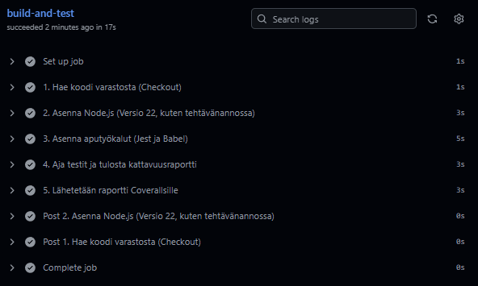
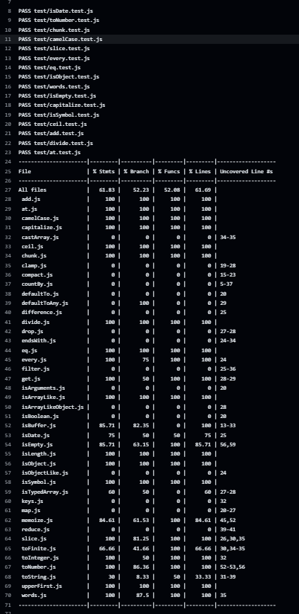
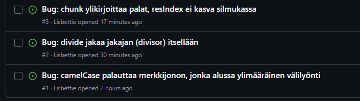

# Palautusrepositorio

### AT00BY10-3012 Ohjelmistojen ylläpito ja testaus

### Testausraportti: Kirjaston laadunvarmistus

## Testausstrategia ja lähestymistapa (Approach)

Testauksessa käytettiin yksikkötestausta (Unit Testing). Lähestymistapa oli kattavuuskeskeinen: tavoitteena oli saavuttaa vähintään 60 % testikattavuus valituille tiedostoille (pois lukien `.internal`-hakemisto).

Strategian vaiheet:

1. Analyysi: Valittiin keskeisiä apufunktioita (Math, String, Array, Lang -kategorioista), joilla on suuri vaikutus kirjaston toimintaan.

2. Toteutus: Kirjoitettiin testitapauksia, jotka kattavat funktion peruskäytön, reunatapaukset (kuten null, undefined, tyhjät taulukot) sekä virheelliset syötteet.

3. Buginhallinta: Kun testauksessa löydettiin poikkeamia dokumentaatioon nähden, viat raportoitiin GitHub Issues -työkalulla. CI-putken pitämiseksi vihreänä, testeihin lisättiin väliaikaiset tarkistukset odottamaan virheellistä tulosta.

4. Jatkuva integraatio: Hyödynnettiin GitHub Actionsia ja Coverallsia testien automaattiseen ajoon ja kattavuuden seurantaan.

## Konfiguraatio (Configuration)

Testausympäristö konfiguroitiin seuraavasti:

- Testauskehys: Jest

- CI/CD: GitHub Actions (käyttäen `node.js.yml` workflow-tiedostoa)

- Kattavuusraportointi: Coveralls.io

- Ajoympäristö: Node.js v22.22.0, Windows 11 (paikallinen), Ubuntu (GitHub Actions)

## Testatut ja testaamattomat tiedostot

Testatut tiedostot (saavutettu kattavuus 100 % tai lähes 100 % per tiedosto):

- add.js
- at.js
- camelCase.js (Bugi löydetty)
- capitalize.js
- ceil.js
- chunk.js (Bugi löydetty)
- divide.js (Bugi löydetty)
- eq.js
- every.js
- isEmpty.js
- isObject.js
- isSymbol.js
- toNumber.js
- words.js

Testaamattomat tiedostot:

- Kaikki .internal-hakemiston tiedostot (rajattu tehtävänannon mukaisesti pois).
- Muut ylätason tiedostot (kuten filter.js, get.js, reduce.js), joita ei tarvittu 60 % rajan saavuttamiseen.

## Löydetyt virheet (Issue Reports)

Testauksen aikana raportoitiin seuraavat kriittiset virheet GitHubissa:

1. Issue #1 (camelCase): Funktio lisää virheellisesti välilyönnin merkkijonon alkuun.

2. Issue #2 (divide): Funktio jakaa jakajan itsellään (divisor / divisor) sen sijaan, että jakaisi jaettavan luvun.

3. Issue #3 (chunk): Funktio ylikirjoittaa palat silmukassa, koska indeksiä ei kasvateta, palauttaen vain viimeisen osan ja undefined-arvoja.

## Loppuarvio: Valmius tuotantoon (Final Verdict)

### Arvio: Kirjasto EI OLE valmis tuotantokäyttöön.

Perustelut:

- Kriittiset bugit: Testauksessa löytyi vakavia loogisia virheitä perusfunktioista (kuten divide ja chunk), jotka vääristävät dataa tai palauttavat täysin vääriä tuloksia.

- Epäjohdonmukaisuus: Koodin toteutus ei vastaa sen omaa dokumentaatiota (esim. toString ja camelCase).

- Testikattavuus: Vaikka 60 % kattavuus on saavutettu, suuri osa kirjaston monimutkaisemmasta logiikasta on edelleen testaamatta, ja jo testatuissa osissa virhetiheys oli huolestuttavan korkea.

- Kirjasto vaatii perusteellisen koodikatselmoinnin ja bugien korjaamisen ennen kuin sitä voidaan harkita käytettäväksi oikeissa projekteissa.

## Kuvat

GitHub Action workflow

Test results

Issues

